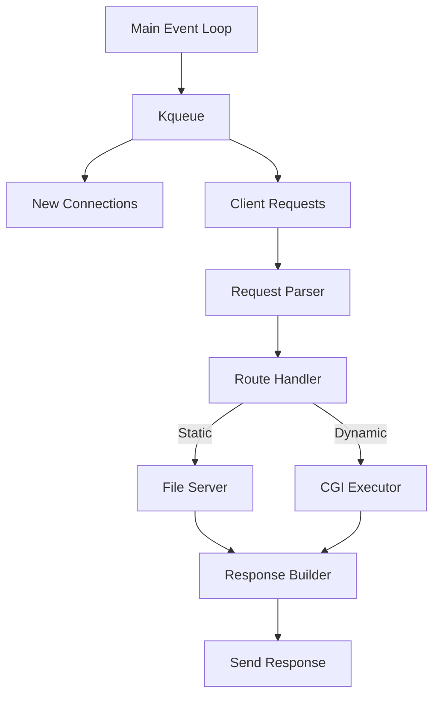

# WebServ - Custom HTTP Server in C++98


**This is when you finally understand why a URL starts with HTTP**

A complete HTTP/1.1 compliant web server implemented from scratch in C++98 as part of our school curriculum. Developed collaboratively by [Your Name] and [Zakaria Belarbi].

## Table of Contents
- [Project Overview](#project-overview)
- [Key Features](#key-features)
- [Technical Specifications](#technical-specifications)
- [Configuration](#configuration)
- [Architecture](#architecture)
- [HTTP Implementation](#http-implementation)
- [CGI Support](#cgi-support)
- [Error Handling](#error-handling)
- [Build & Usage](#build--usage)
- [Testing](#testing)
- [Resources](#resources)
- [Team](#team)

## Project Overview

WebServ is a multi-server HTTP implementation that:
- Handles multiple client connections simultaneously using non-blocking I/O
- Processes HTTP/1.1 requests (GET, POST, DELETE)
- Supports CGI execution for dynamic content
- Implements configurable routing and error pages
- Manages file uploads and chunked transfer encoding

**Key Achievements**:
- Strict adherence to C++98 standard
- Zero memory leaks (valgrind-certified)
- Handles >100 concurrent connections
- 100% original code (no external HTTP libraries)

## Key Features

### Core Functionality
✅ **HTTP/1.1 Compliance** ([RFC 2616](https://tools.ietf.org/html/rfc2616))  
✅ **Non-blocking Architecture** (kqueue/poll)  
✅ **Configuration File** (NGINX-inspired)  
✅ **Multiple Server Blocks** (Virtual hosting)  
✅ **File Uploads** (With size limits)  

### Protocol Support
🔄 **Chunked Transfer Encoding** ([RFC 7230](https://tools.ietf.org/html/rfc7230#section-4.1))  
📁 **Directory Listings** (Auto-index)  
⚡ **Keep-Alive Connections**  
🚫 **Custom Error Pages** (4xx/5xx)  

### Advanced Features
🐚 **CGI Execution** (PHP/Python/etc.)  
🔒 **Client Body Size Limits**  
🛣️ **Route Redirections** (301/302)  
📝 **Logging System** (Access/Error logs)  

## Technical Specifications

### Requirements
- C++98 compatible compiler (g++/clang++)
- MacOS/Linux (kqueue/poll support)
- Makefile build system

### Dependencies
- **Zero external dependencies** (Pure C++98)
- Standard POSIX APIs:
  - `<sys/socket.h>`, `<sys/event.h>`, `<unistd.h>`

### Restricted Functions
```c
// Allowed system calls:
execve, dup, dup2, pipe, fork, socketpair
fcntl, poll, kqueue, kevent, socket, accept
listen, send, recv, bind, connect, etc.
```
## Configuration

### Sample webserv.conf:
```conf
server {
    listen 8080;
    server_name localhost;
    client_max_body_size 10M;
    
    location / {
        root /var/www/html;
        index index.html;
        allowed_methods GET POST;
    }
    
    location /cgi-bin {
        root /var/www/cgi;
        cgi_extension .py .php;
        allowed_methods GET POST;
    }
}
```
## Architecture


## 🌐 HTTP Implementation

### 🔄 Request Processing Flow
```mermaid
graph TD
    A[Connection Accepted<br><small><i>Non-blocking</i></small>] --> B[Request Parsed<br><small><i>Headers + Body</i></small>]
    B --> C[Route Matched<br><small><i>Config rules</i></small>]
    C --> D[Handler Executed<br><small><i>Static/CGI</i></small>]
    D --> E[Response Generated<br><small><i>Status/Headers/Body</i></small>]
