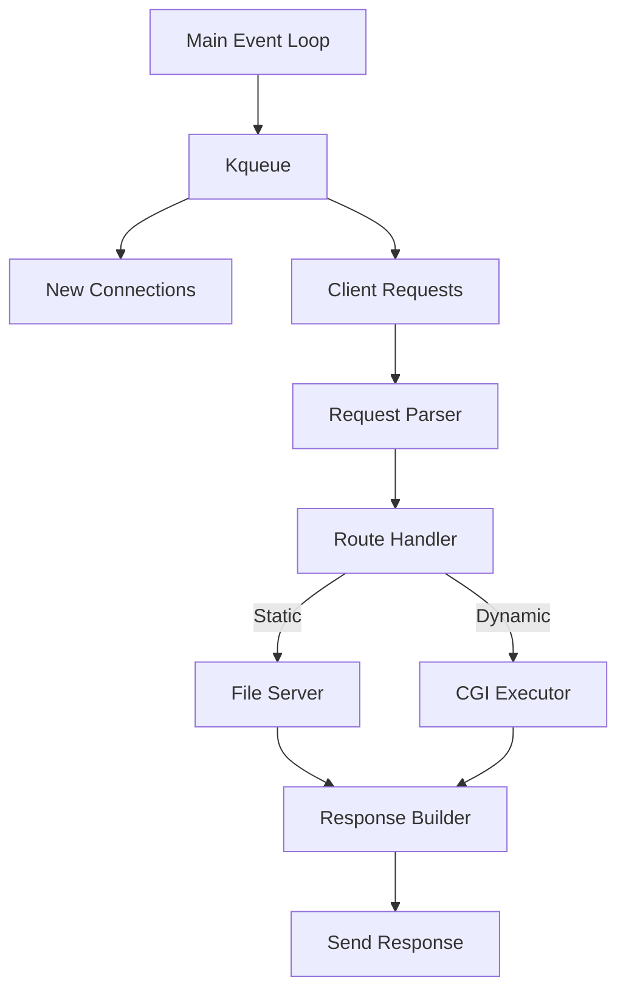
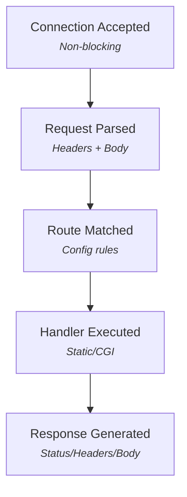

# WebServ - Custom HTTP Server in C++98

<div style="background-color: black">

</div>
**This is when you finally understand why a URL starts with HTTP**

A complete HTTP/1.1 compliant web server implemented from scratch in C++98 as part of our school curriculum. Developed collaboratively by [Your Name] and [Zakaria Belarbi].

## Table of Contents
- [Project Overview](#project-overview)
- [Key Features](#key-features)
- [Technical Specifications](#technical-specifications)
- [Configuration](#configuration)
- [Architecture](#architecture)
- [HTTP Implementation](#http-implementation)
- [CGI Support](#cgi-support)
- [Error Handling](#error-handling)
- [Build & Usage](#build--usage)
- [Resources](#resources)
- [Team](#team)

## Project Overview

WebServ is a multi-server HTTP implementation that:
- Handles multiple client connections simultaneously using non-blocking I/O
- Processes HTTP/1.1 requests (GET, POST, DELETE)
- Supports CGI execution for dynamic content
- Implements configurable routing and error pages
- Manages file uploads and chunked transfer encoding

**Key Achievements**:
- Strict adherence to C++98 standard
- Zero memory leaks (valgrind-certified)
- Handles >100 concurrent connections
- 100% original code (no external HTTP libraries)

## Key Features

### Core Functionality
✅ **HTTP/1.1 Compliance** ([RFC 2616](https://tools.ietf.org/html/rfc2616))  
✅ **Non-blocking Architecture** (kqueue/poll)  
✅ **Configuration File** (NGINX-inspired)  
✅ **Multiple Server Blocks** (Virtual hosting)  
✅ **File Uploads** (With size limits)  

### Protocol Support
🔄 **Chunked Transfer Encoding** ([RFC 7230](https://tools.ietf.org/html/rfc7230#section-4.1))  
📁 **Directory Listings** (Auto-index)  
⚡ **Keep-Alive Connections**  
🚫 **Custom Error Pages** (4xx/5xx)  

### Advanced Features
🐚 **CGI Execution** (PHP/Python/etc.)  
🔒 **Client Body Size Limits**  
🛣️ **Route Redirections** (301/302)  
📝 **Logging System** (Access/Error logs)  

## Technical Specifications

### Requirements
- C++98 compatible compiler (g++/clang++)
- MacOS/Linux (kqueue/poll support)
- Makefile build system

### Dependencies
- **Zero external dependencies** (Pure C++98)
- Standard POSIX APIs:
  - `<sys/socket.h>`, `<sys/event.h>`, `<unistd.h>`

### Restricted Functions
```c
// Allowed system calls:
execve, dup, dup2, pipe, fork, socketpair
fcntl, poll, kqueue, kevent, socket, accept
listen, send, recv, bind, connect, etc.
```
## Configuration

### Sample webserv.conf:
```conf
server {
    listen 8080;
    server_name localhost;
    client_max_body_size 10M;
    
    location / {
        root /var/www/html;
        index index.html;
        allowed_methods GET POST;
    }
    
    location /cgi-bin {
        root /var/www/cgi;
        cgi_extension .py .php;
        allowed_methods GET POST;
    }
}
```
## Architecture


## 🌐 HTTP Implementation

### 🔄 Request Processing Flow


### 🛠️ Supported Methods  
- **`GET`** → Retrieve resources  
- **`POST`** → Submit data/CGI  
- **`DELETE`** → Remove resources  


---

## 🚀 CGI Support

### 🔧 Key Features
- **Env Variables**: `PATH_INFO`, `QUERY_STRING`, `REQUEST_METHOD`, etc.
- **Methods Supported**:
  - `GET`: Parameters via URL
  - `POST`: Data via stdin

### 📝 PHP Example
```php
<?php
echo "HTTP/1.1 200 OK\r\n";
echo "Content-Type: text/html\r\n\r\n";
echo "<h1>Hello from WebServ!</h1>";
?>
```

---

## 🛡️ Error Handling

### 🏗️ Robust Design Principles
- **No uncaught exceptions** → Fail-safe defaults  
- **Custom error pages** → Branded UX for errors  
- **Comprehensive logging** → Detailed debug trails  

### 🚨 Common HTTP Error Codes
| Code | Status Text           | Typical Cause                          |
|------|-----------------------|----------------------------------------|
| `400`| Bad Request           | Malformed client request               |
| `403`| Forbidden             | Unauthorized resource access           |
| `404`| Not Found             | Invalid URI path                       |
| `405`| Method Not Allowed    | Unsupported HTTP verb for route        |
| `500`| Internal Server Error | Server-side processing failure         |
| `501`| Not Implemented       | Unavailable server functionality       |

*All errors trigger both user-facing responses and backend logs.*


---

## 🛠️ Build & Usage

### 📥 Clone the Repository
```bash
# Clone the project
git clone https://github.com/yourusername/webserv.git

# Change directory to webserv
cd webserv

# Build project
make

# Run server (with config file)
./webserv config/config.conf

# Test with curl
curl -v http://localhost:8080/
```

## 📚 Resources

### 🔍 Essential Reading

| Resource | Description |
|----------|-------------|
| [**HTTP/1.1 (RFC 2616)**](https://tools.ietf.org/html/rfc2616) | Official HTTP protocol specification |
| [**Kqueue Tutorial**](https://www.freebsd.org/cgi/man.cgi?query=kqueue) | Event notification system for BSD/macOS |
| [**CGI 1.1 Specification**](https://tools.ietf.org/html/rfc3875) | Common Gateway Interface standards |
| [**Socket Programming**](https://beej.us/guide/bgnet/) | Network programming fundamentals |

### 🛠️ Recommended Tools
- [Postman](https://www.postman.com/) - API development & testing  
- [Burp Suite](https://portswigger.net/burp) - **Web security testing** (Proxy/Scanner/Repeater)  

---

### Why Burp Suite?
```diff
+ Perfect for testing your server's:
  - Request/Response inspection
  - Security vulnerability scanning
  - Session manipulation
  - Automated penetration testing
```

## 👥 Team

This project was coded 💻 line-by-line through pair programming: 

### 🚀 Core Contributors

<table>
  <tr>
    <td align="center" width="50%">
      <br>
      <b>Mohammed Omari</b><br>
      <a href="https://github.com/momari-42">@momari</a><br>
      <a href="https://www.linkedin.com/in/mohammed-omari-24a338249/">LinkedIn</a>
    </td>
    <td align="center" width="50%">
      <br>
      <b>Zakaria Belarbi</b><br>
      <a href="https://github.com/zakariabelarbi">@zakariabelarbi</a><br>
      <a href="https://linkedin.com/in/zakaria-belarbi">LinkedIn</a>
    </td>
  </tr>
</table>

### 🤝 Collaboration Philosophy

```diff
+ 100% Pair Programming
+ Daily Code Reviews
+ Shared Code Ownership
+ Continuous Learning
```
